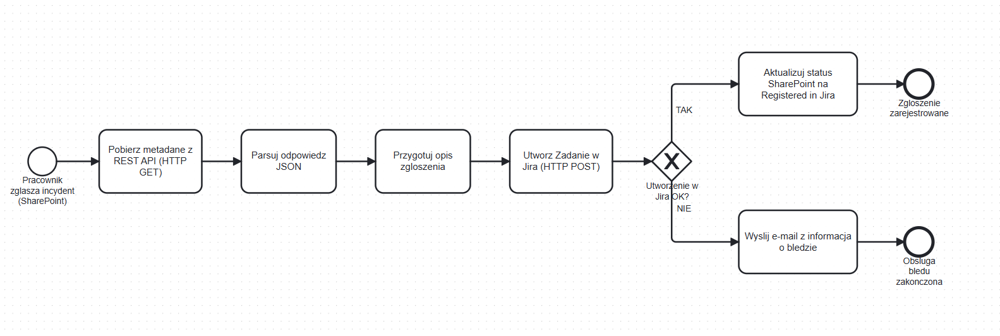

# Automated Incident Management Flow

Automatyzacja zgłaszania incydentów: od rejestracji na liście SharePoint, przez wzbogacenie danych z REST API, po utworzenie zgłoszenia w Jira Cloud z obsługą błędów.

Stack: Power Automate (Cloud Flow), SharePoint, Jira Cloud REST API v2.

> Projekt demo end-to-end w środowiskach deweloperskich. Zamiast konektora Jira użyto bezpośredniego wywołania REST API (HTTP POST). Uzasadnienie w [ADR-001](docs/adr.md).

## Tech stack

| Warstwa | Technologia |
|---|---|
| Silnik automatyzacji | Power Automate (Cloud Flow) |
| Źródło danych i wyzwalacz | Lista SharePoint (`Incidents`) |
| System docelowy | Jira Cloud, REST API v2 (HTTP POST, Basic Auth + token API) |
| Integracja zewnętrzna | REST API, HTTP GET + Parse JSON + Compose (`jsonplaceholder`) |
| Uwierzytelnianie | Basic Auth z tokenem API (nie hasłem konta) |
| Obsługa błędów | Wzorzec Try/Catch (dwa bloki Scope + Configure run after), powiadomienie e-mail |

## Architektura

Zrealizowane iteracje: v1 (rdzeń integracji), v2 (wzbogacony opis), v3 (priorytet i zwrotna aktualizacja statusu), v4 (obsługa błędów).


1. Wyzwalacz: utworzenie elementu na liście SharePoint `Incidents`.
2. HTTP GET do zewnętrznego REST API (`https://jsonplaceholder.typicode.com/users/1`).
3. Przeanalizuj dane JSON: schemat wygenerowany z pełnej odpowiedzi endpointu.
4. Compose: złożenie opisu zgłoszenia z pola Description rekordu i danych z API (`name`, `email`), z formatowaniem tekstowym.
5. Scope "Try": HTTP POST do `https://<instancja>.atlassian.net/rest/api/2/issue` (Basic Auth: e-mail + token API; body JSON z mapowaniem Summary, Description z Compose, Priority), następnie Update item w SharePoint ustawiający status na `Registered in Jira` (Id z wyzwalacza).
6. Scope "Catch" (`Configure run after` = has failed / is skipped / has timed out): Wyślij e-mail (V2) z powiadomieniem o błędzie; tokeny w treści pochodzą z wyzwalacza.

Efekt: utworzenie wpisu na liście SharePoint tworzy zgłoszenie w Jira (Summary, wzbogacony Description, Priority) i oznacza rekord jako `Registered in Jira`. Nieudane wywołanie pomija aktualizację statusu i wysyła powiadomienie e-mail.

Lista źródłowa i utworzone zgłoszenie:


## Proces (BPMN)



Model procesu (BPMN 2.0) - stan zaimplementowany: rejestracja incydentu, pobranie i parsowanie metadanych z API, utworzenie zgłoszenia w Jira z obsługą błędów (Try/Catch) i powiadomieniem e-mail przy niepowodzeniu.

## Kluczowe elementy techniczne

Body zgłoszenia Jira (HTTP POST):

```json
{
  "fields": {
    "project":   { "key": "SCRUM" },
    "issuetype": { "name": "Zadanie" },
    "summary":     "<Title z listy SharePoint>",
    "description": "<wynik akcji Compose: Description + name + email z API>",
    "priority":  { "name": "<Priority z listy SharePoint: Low / Medium / High>" }
  }
}
```

Pole `description` jest wynikiem akcji Compose (tokeny dynamiczne, formatowanie), nie wyrażenia `concat`. Nazwy priorytetów są wspólne dla obu systemów, więc wartość przechodzi bez tłumaczenia.

Uwierzytelnianie: Basic Auth z tokenem API zamiast hasła konta. Mechanika i uzasadnienie w [adr.md](docs/adr.md).

## Odtworzenie środowiska

1. Power Apps Developer Plan: środowisko z Power Automate (wymaga konta służbowego Entra ID).
2. Jira Cloud: projekt typu Software, klucz projektu w demo to `SCRUM`.
3. Lista SharePoint `Incidents` z polami Title, Description, Priority (`Low` / `Medium` / `High`) oraz Status z opcją `Registered in Jira`.
4. Przepływ budowany ręcznie w Power Automate zgodnie z opisem architektury powyżej. Po zbudowaniu: konfiguracja połączenia SharePoint, adresu e-mail dla powiadomień o błędach oraz wygenerowanie własnego tokenu API Jiry.

## Możliwe rozszerzenia

- Synchronizacja zwrotna Jira do SharePoint (np. `In Progress`, `Done`) po zmianie statusu zgłoszenia.
- Wartość domyślna `New` i ukrycie pola Status w formularzu tworzenia, aby zgłaszający nie ustawiał statusu ręcznie (patrz [ADR-007](docs/adr.md)).
- Wariant wywołania przez konektor oparty o opis OpenAPI oraz migracja na Jira API v3 (ADF).

## Dokumentacja

| Dokument | Zawartość |
|---|---|
| [`docs/requirements.md`](docs/requirements.md) | Wymagania funkcjonalne i niefunkcjonalne, pokrycie w iteracjach, mapowanie statusów |
| [`docs/adr.md`](docs/adr.md) | Decyzje architektoniczne (ADR) |

## Uwagi projektowe

- Akcja HTTP w Power Automate jest akcją premium, dostępną w Developer Planie.
- `jsonplaceholder.typicode.com` to publiczny serwis z danymi testowymi; w tym demo symuluje firmowe API metadanych.
