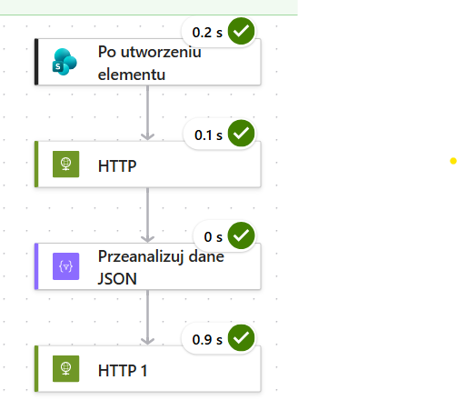
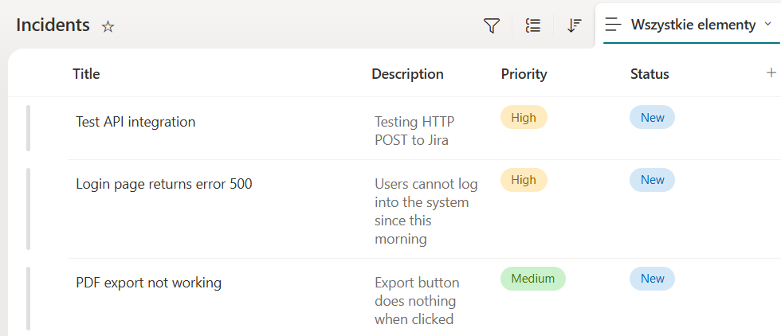
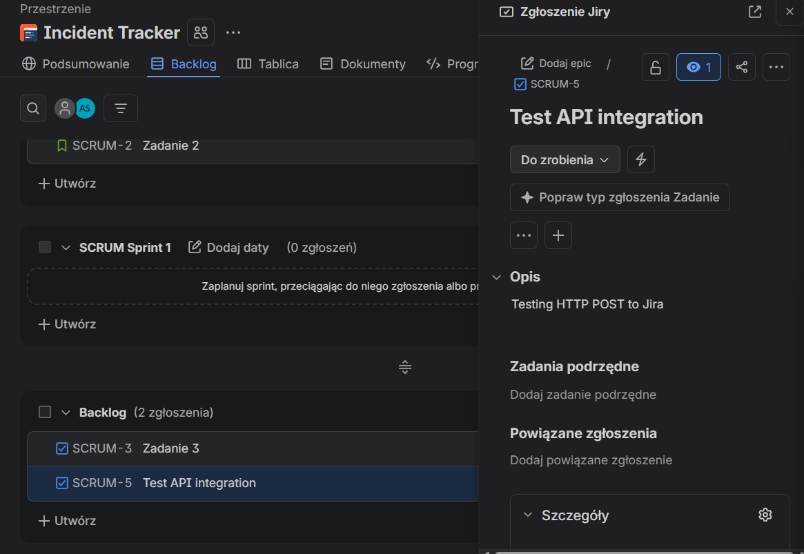
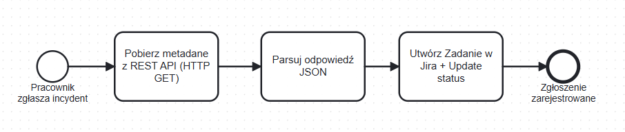

# Automated Incident Management Flow

Automatyzacja zgłaszania incydentów: od rejestracji na liście SharePoint po utworzenie zgłoszenia w Jira Cloud przez bezpośrednie wywołanie REST API.

Stack: Power Automate (Cloud Flow), SharePoint, Jira Cloud REST API v2.

> Projekt demo end-to-end w środowiskach deweloperskich. Zamiast konektora Jira użyto bezpośredniego wywołania REST API (HTTP POST). Uzasadnienie w [ADR-001](docs/adr.md).

## Tech stack

| Warstwa | Technologia |
|---|---|
| Silnik automatyzacji | Power Automate (Cloud Flow) |
| Źródło danych i wyzwalacz | Lista SharePoint (`Incidents`) |
| System docelowy | Jira Cloud, REST API v2 (HTTP POST, Basic Auth + token API) |
| Integracja zewnętrzna | REST API, HTTP GET + Parse JSON (`jsonplaceholder`) |
| Uwierzytelnianie | Basic Auth z tokenem API (nie hasłem konta) |

## Architektura v1



1. Wyzwalacz: utworzenie elementu na liście SharePoint `Incidents`.
2. HTTP GET do zewnętrznego REST API (`https://jsonplaceholder.typicode.com/users/1`).
3. Przeanalizuj dane JSON: schemat wygenerowany z pełnej odpowiedzi endpointu.
4. HTTP POST do `https://<instancja>.atlassian.net/rest/api/2/issue` (Basic Auth: e-mail + token API, body JSON z mapowaniem pól Title i Description).

Efekt: utworzenie wpisu na liście SharePoint tworzy zgłoszenie w Jira z polami Summary i Description zmapowanymi z pól listy.

Lista źródłowa i utworzone zgłoszenie:





## Proces (BPMN)



Diagram odwzorowuje wersję v1: rejestracja incydentu, pobranie i parsowanie metadanych z REST API, utworzenie zgłoszenia w Jira. Obsługa błędów (Try/Catch) oraz zwrotna aktualizacja statusu rekordu wejdą w kolejnej iteracji.

## Kluczowe elementy techniczne

Body zgłoszenia Jira (HTTP POST):

```json
{
  "fields": {
    "project":   { "key": "SCRUM" },
    "issuetype": { "name": "Zadanie" },
    "summary":     "<Title z listy SharePoint>",
    "description": "<Description z listy SharePoint>"
  }
}
```

Uwierzytelnianie: Basic Auth z tokenem API zamiast hasła konta. Mechanika i uzasadnienie w [adr.md](docs/adr.md).

## Odtworzenie środowiska

1. Power Apps Developer Plan: środowisko z Power Automate (wymaga konta służbowego Entra ID).
2. Jira Cloud: projekt typu Software, klucz projektu w demo to `SCRUM`.
3. Lista SharePoint `Incidents` z polami Title, Description oraz opcjonalnie Priority i Status.
4. Przepływ budowany ręcznie w Power Automate zgodnie z opisem architektury powyżej. Po zbudowaniu: konfiguracja połączenia SharePoint i wygenerowanie własnego tokenu API Jiry.

## Możliwe rozszerzenia

- Wzbogacenie opisu zgłoszenia o pola z API (`name`, `email`, `company`).
- Zwrotna zmiana statusu elementu SharePoint na `In Progress` po utworzeniu zgłoszenia.
- Obsługa błędów: blok Scope (Try/Catch) z `Configure run after` i powiadomieniem e-mail z logiem.
- Wariant wywołania przez konektor oparty o opis OpenAPI oraz migracja na Jira API v3 (ADF).

## Dokumentacja

| Dokument | Zawartość |
|---|---|
| [`docs/requirements.md`](docs/requirements.md) | Wymagania funkcjonalne i niefunkcjonalne, pokrycie w iteracjach, mapowanie statusów |
| [`docs/adr.md`](docs/adr.md) | Decyzje architektoniczne (ADR) |

## Uwagi projektowe

- Akcja HTTP w Power Automate jest akcją premium, dostępną w Developer Planie.
- `jsonplaceholder.typicode.com` to publiczny serwis z danymi testowymi; w tym demo symuluje firmowe API metadanych.
